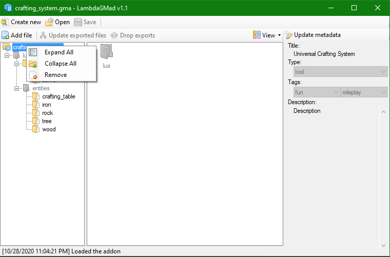

LambdaGMad
=========

LambdaGMad is a tool used to create and extract Garry's
Mod workshop addon packages
(_.gma_ files). It is a fork of [Whisperity's SharpGMad](https://github.com/whisperity/SharpGMad) that aims to make the program more usable with modern versions of GMad.

Usage
-----

### Realtime mode

This is the main feature and reason for LambdaGMad's existence. While gmad
can only fully pack a folder into an addon or fully extract an addon to a
folder, with LambdaGMad, you can effectively browse a file just as how you
would be browsing any other archive (for example, ZIP, RAR or TAR files).

The realtime mode supports **on-the-fly** adding, removing and updating of
files. Using the _Export_ feature, a single file can be exported anywhere
on your filesystem and edited with any appropriate editor. When you are
done with the changes, a single click of a button will _pull_ these
changes into the archive.

Both a graphical and a command-line interface is available for realtime
mode.

#### GUI

`LambdaGMad [path]`

If the program is started with no command-line arguments (or only one, and
that is a file path), a graphical interface will load. (You can also
**drag & drop** a file in your file explorer onto LambdaGMad's executable
to open it automatically.)

#### Terminal

`LambdaGMad realtime`

Starting LambdaGMad with the _realtime_ argument from the terminal loads
its shell. If you are more savvy with using the terminal for quick
operation, this mode is for you. Every operation possible in the graphical
mode has a counterpart in the terminal (and vice-versa).

Type `help` in the shell to see a list of available commands.

Optionally, you can specifiy a file as an extra argument to have it loaded
initally:

`LambdaGMad realtime -file "C:\steam\etc\garrysmod\addons\my_addon_12345.gma"`

Compiling and requirements
--------------------------

LambdaGMad is written using the .NET 4.0 framework. This is the only
requirement, you can compile the solution with any development environment
on any computer compatible with .NET 4.0. This usually means a computer with at least Windows XP Service Pack 3
installed.

Cross-platform operation with [Mono](http://www.mono-project.com/) is also
supported, but is currently untested on Mac and Linux.

Disclaimer
----------

The program _LambdaGMad_ is provided "AS IS" without any expressed or
implied warranties. 

It is a general rule of thumb that you should **NEVER** start editing
files you hadn't made backup of beforehand. The creators refuse to be held
liable for any damange caused by the usage of this piece of software.
